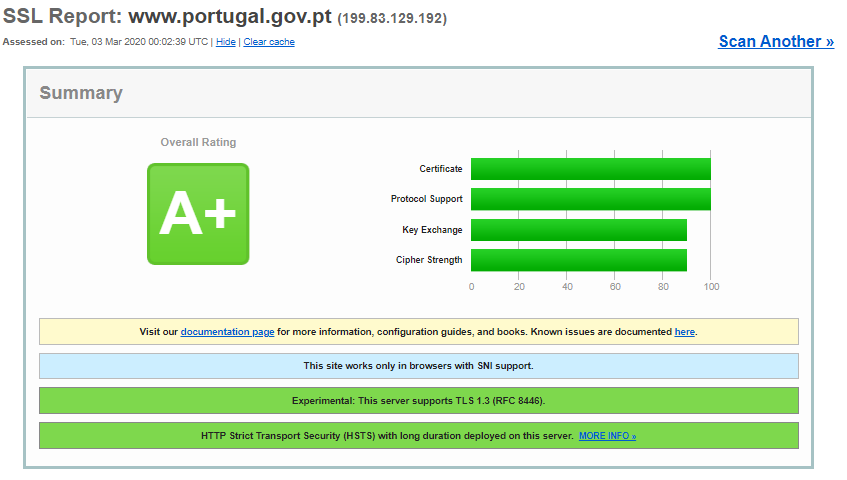
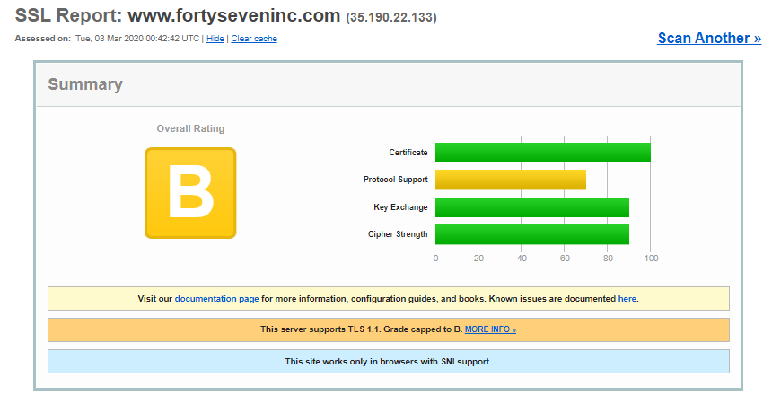
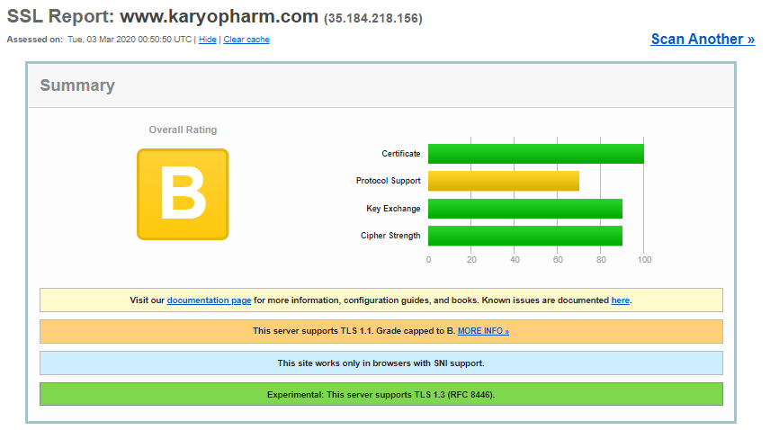
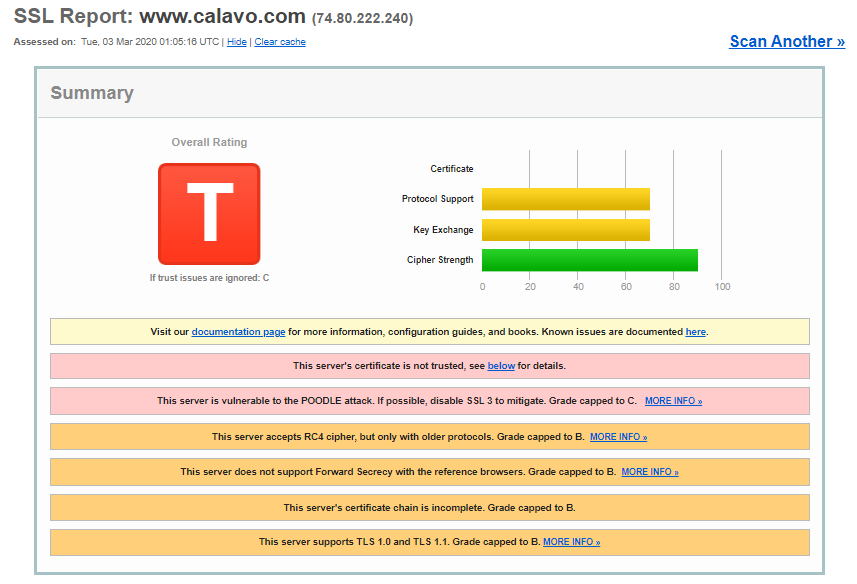
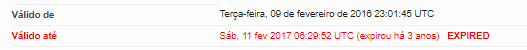
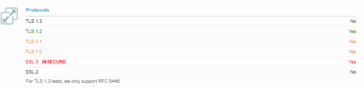
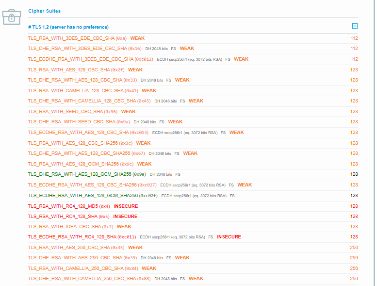
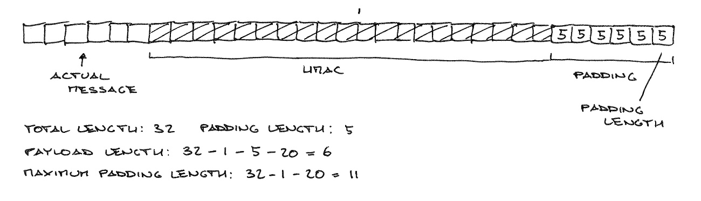

## Experiência 2.1

#### Questão

**Vá ao site www.ssllabs.com e efetue o SSL Server test para o site do Governo Português https://www.portugal.gov.pt/. E analise resultado.**

Podemos observar que o SSL report classifica o host (https://www.portugal.gov.pt/) como A+, isto deve-se ao fato de este site trabalhar em browsers com suporte Server Name Indication, o que permite ao servidor hospedar com segurança diversos certificados  TLS/SSL de diversos sites apenas num único ip. Além disso tem implementada HSTS com longa duração, o que lhe permite estar protegido contra ataques de downgrade protocol e também “roubo” de cookies.
No restante relatório podemos ver informações sobre certificado: o tipo de algoritmo usado(SHA256withRSA), o tamanho da chave(2048 bits), a data de validade do certificado, o emissor do certificado entre outros parâmetros referentes ao certificado em questão.
Abaixo temos mais alguns certificados adicionais e os seus respetivos dados, e por fim temos um descrição de quais protocolos são aceites/usados e suas respetivas versões, além das Cipher Suites.

## Questão 2.1

**Escolha dois sites de empresas cotadas no NASDAQ.**
1. Anexe os resultados do SSL Server test à sua resposta.
2. Analise o resultado do SSL Server test relativo ao site escolhido com pior rating. Que comentários pode fazer sobre a sua segurança. Porquê?
3. É natural que tenha reparado na seguinte informação: "OpenSSL Padding Oracle vuln. (CVE-2016-2107)" na secção de detalhe do protocolo. O que significa, para efeitos práticos?

Imagem – SSL Report do site da empresa fortyseveninc

Imagem – SSL Report do site da empresa karyopharm

Imagem – SSL Report da empresa Calavo Growers

## Questão 2.1.2

Na recolha dos relatórios SSL podemos verificar que grande parte dos sites das empresas cotadas no NASDAQ possuem uma avaliação semelhante, logo escolhemos um relatório que se sobressaiu aos outros, o da empresa Calavo Growers, e é deste relatório que iremos fazer análise.
Este relatório classifica o site da empresa Calavo Growser Inc. com T, ou se ignorarmos os problemas de confiança seria classificada com C. Esta avaliação deve-se principalmente ao fato do certificado deste server não ser confiável. Na analise do certificado é possível observar o porquê, pois o certificado em questão está expirado(fora de validade), como se pode verificar na figura abaixo.

Para além do certificado expirado, este server está vulnerável ataques POODLE, sendo possível mitigar desativando SSL 3 . O site também aceita cifras RC4 com protocolos antigos considerados “Fracos” e até mesmo “Inseguros”. O fato deste server não suportar Forward Secrecy nos browser de referencia e de suportar TLS 1.0 e TLS 1.1 torna esta avaliação ainda mais negativa. 

Porque ao não usar sigilo direto, o sigilo de encaminhamento acaba por não proteger as sessões anteriores contra futuros comprometimentos da chave privada. Principalmente com a troca de chaves RSA que não fornece sigilo direto. 

## Questão 2.1.3
Inicialmente começamos por analisar o CVE fornecido na NVD(National Vulnerability DataBase), onde verificamos que se trata da implementação da AES-NI numas quantas versões do OpenSSL não considerar a alocação de memória durante uma determinada verificação de preenchimento, o que pode levar aos atacantes obtenher informações sensíveis em texto limpo, isto é não criptografado por meio de um ataque de padding-oracle a uma sessão AES CBC . É uma vulnerabilidade classificada com 5.9 pela NVD, o que é considerada com um risco médio. Segundo um artigo disponibilizado pelo próprio relatório SSL, diz-nos que os conjuntos de cifras CBC no TLS possuem uma falha de design: primeiro calculam o HMAC do texto sem formatação e depois criptografam, isto usando Cipher Block Chaining. Porem quem recebe tenha que decifrar a mensagem e comparar o HMAC sem nunca dar a conhecer o tamanho de padding. Caso o atacante conheça o tamanho poderá aprender o ultimo byte de cada bloco e iterativamente, a mensagem na sua totalidade. A isto é chamado padding oracle.

Neste mesmo bloco, é referido uma solução que se baseia no seguinte:
“Escrever todo o HMAC e o código de verificação do padding de modo a executar em tempo perfeitamente constante.” 
Referência: https://blog.cloudflare.com/yet-another-padding-oracle-in-openssl-cbc-ciphersuites/
Resumidamente, o ponto crucial desta vulnerabilidade é guardar a comparação de cada bit da verificação, isto permite que o atacante apenas saiba se tudo ta certo ou errado.

