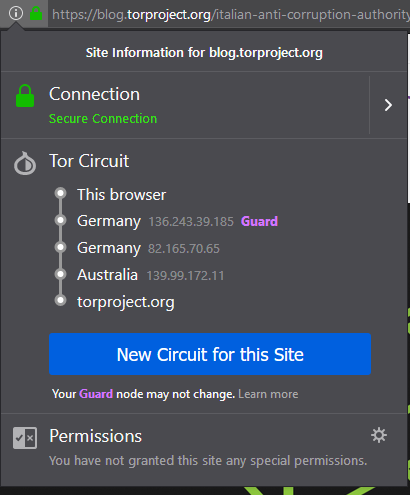
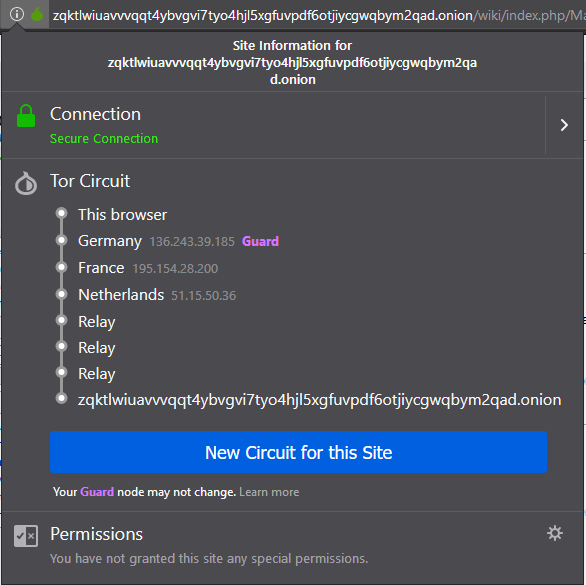

## Experiencia 1.1

1-2

Ao usar o comando sudo anonsurf start forçamos o encerramento do browser caso ele esteja aberto, elimina alguns elementos da cache que podem ser perigosos e encerra os serviços IPv6 e começamos então a navegar em modo anonimo, como é se pode ver no output que nos foi dado no terminal.

```bash
* killing dangerous applications
 * cleaning some dangerous cache elements
[ i ] Stopping IPv6 services:


[ i ] Starting anonymous mode:

 * Modified resolv.conf to use Tor and Private Internet Access DNS
 * All traffic was redirected through Tor

[ i ] You are under AnonSurf tunnel
```

3-

Após isto, verificamos novamente a localização do nosso ip, este mudou.

4-5

Com o comando sudo anonsurf change voltamos a mudar.

6-7

E com o comando sudo anonsurf stop terminamos a navegação anonima e voltamos a ter o ip inicial, obtemos o seguinte do terminal:

```bash
* killing dangerous applications
 * cleaning some dangerous cache elements
[ i ] Stopping anonymous mode:

 * Deleted all iptables rules

 * Iptables rules restored

[ i ] Reenabling IPv6 services:

* Anonymous mode stopped
```


## Questão 1.1

**Efetuando o comando sudo anonsurf start consegue garantir que está localizado nos EUA?**

Resposta:

Não, com este comando apenas sabemos que seremos ligados a uma outra maquina aleatoria, deste modo não é possível garantir a localização precisa.


## Questão 2

Resposta:

Isto acontece, pois o protocolo em questão faz uso dum roteamento por camadas, usa a rede voluntaria de servidores do projeto, que se encontram espalhados pelo globo, a partir dai ele cria circuitos, estes que servem para “trafegarem” os dados do usuário. Neste sentido, estes circuitos tem um tempo de duraçao e são selecionados a partir de um algoritmo. 
Como não possuimos controlo sobre os circuitos estes encontram-se sempre em mudança, impossibilitando assim garantir uma localizaçao geografica de todos os nós, consequentemente não garantimos que a a localizaçao do nosso ip se encontre nos EUA.


## Experiência 1.2



Como se pode verificar pelas imagens acima, por cada nova conexão feita pelo Tor Browser é realizado um novo redirecionamento dos pacotes trocados entre as duas entidades. O que podemos afirmar é que á uma constante mudança na camada de redirecionamento, além disso como não se trata de um servidor que faça uso do protocolo em estudo, verificamos que apenas foram feitos 3 saltos(sem relay). 


## Questão 1.2.1

**Clique no lado esquerdo da barra de URL ((i)) e verifique qual é o circuito para esse site.**

Resposta:
Foram então verificados os circuitos para os dois primeiros sites e anexados a este documento.




Verificamos a priori que em ambos os casos e como já correspondem a endereços que fazem uso do protocolo Tor, estes mostram os tais Onion Routers selecionados pelas duas entidades, três de cada.


## Questão 1.2.2

**Porque existem 6 "saltos" até ao site Onion, sendo que 3 deles são "relay"? Utilize características do protocolo TOR para justificar.**

Resposta:

Inicialmente para se obter uma sessão segura a um serviço quaisquer, é preciso criar um circuito. De modo geral, são totalizados seis saltos entre o usuário e o serviço, três deles correspondem ao Onion Routers. Atraves destes Onion Routers é possível garantir que ninguém consiga identificar o serviço ao qual estamos a tentar acessar. Pois OR1 apenas sabe que nós estamos a usar a rede Tor, no caso do OR2 não consegue obter informações de lado nenhum, pois este é responsável apenas por reencaminhar a informação do OR1 para o OR3 que se encontra cifrada, e por fim o OR3 mesmo conhecendo a informação decifrada, não consegue determinar a origem. Mas apenas isto não chega, pois isto é apenas referente ao anonimato do utilizador aos serviços, deste modo é necessário que o protocolo também realize o anonimato para o serviço, e para isto ele faz uso da mesma “funcionalidade” e realiza três saltos que correspondem aos OR’s escolhidos pelo Onion Proxy do fornecedor do serviço em causa.
Além disso, os três “relays” que é exibido na imagem acima, são exibidos dessa forma pois correspondem ao circuito TOR que for criado entre o rendezvous point e o servidor web, assim sendo não nos é possível obter mais informações sobre os mesmos.

#### Referência

https://svn-archive.torproject.org/svn/projects/design-paper/tor-design.pdf 
https://2019.www.torproject.org/about/overview.html.en
