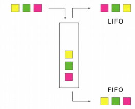

## Pergunta 1


&nbsp;
### Pergunta 1.1


&nbsp;
O algoritmo tem o comportamento de armazenar numa lista(buffer) uma quantidade   
de numeros que são pedidos no inicio tantos numeros quantos aqueles que são colocados.   
Comparando o mesmo programa em três línguas distintas, verificamos essencialmente diferenças que caracterizam cada linguagem.   
Além disso, é possível verificar a existencia de erros na execuçao de cada um dos ficheiros.   
Mas ambos tem um problema em comum, a falta de um verificador no primeiro input colocado pelo user,   
visto que este está relacionado com a primeira variável do tipo inteiro, pois esta   
determina  o numero máximo de números no buffer.  
- 1º cria um buffer de tamanho 10  
- 2º recebe um input de numeros que queremos colocar nesse buffer.  
- 3º Na execuçao, se colocar-mos um valor superior a 10 numeros, o programa devolverá um erro de index, neste caso index fora de range.  


#### Java


No programa java foram observadas as seguintes exceçoes:  


Ao introduzir um inteiro superior a 10 no primeiro input, ao chegar ao 11 elemento, obtemos a seguinte exceção:  
Exception in thread "main" java.lang.ArrayIndexOutOfBoundsException: Index 10 out of bounds for length 10  
Variavel inicial que impossibilita inserir além do tamanho do buffer.  
  

Ao introduzir um numero com mais de 10 digitos, obtemos a seguinte exceção:  

Exception in thread "main" java.util.InputMismatchException:   
Isto deve-se ao fato de se tratar de um numero superior a 10.  


Ao introduzir um numero negativa, observamos que o programa é terminado de imediato.  
Visto que o valor é negativo no count, logo não entra no ciclo.  


Ocorreram outros problemas mas todos semelhantes aos já apresentados.  


#### Python


Ao introduzir valores além do tamanho da lista,mais de 10 numeros, obtemos esta exceção:  

IndexError: list assignment index out of range  

Deve-se ao fato de existir uma variável inicial que indica o tamanho do buffer como sendo de 10 posiçoes e nada mais que isso.  
 

Ao introduzir valores de comprimento exagerado observamos que não ocorre qualquer erro ou exceção, diferente da versão em java.  
Tal ocorrencia, deve-se pelo fato que os numeros inteiros Python tem uma precisao arbitraria, deste modo a possibilidade de Overflow é nula.  


Ao introduzir um valor exagerado no primeiro input, obtemos este erro:  

OverflowError: range() result has too many items  

Acontece pois o range() acaba por devolver demasiados resultados possíveis, logo havendo Overflow.  

Ao inserir valor negativo o programa termina de imediato.  
  
Além destes, também foi possível observar que era possível chamar funçoes no input do programa,  
sendo este, talvéz a parte mais suscetível em termos de segurança.  


#### C++


Aqui como nos outros é verificado praticamente os mesmos erros e exceçoes que os exemplos anteriores.   
Entre eles, o Overflow de inteiros, a introduçao de numeros negativos, inserçao de valores alem do indice 10 do buffer  
 e por ultimo a quantidade de digitos que um input pode ter, estando entre 0 e 10 digitos.  


Com esta analise, podemos concluir que a falta de verificadores de input está presente em ambos os exemplos,   
os erros apresentados são bastante semelhantes mesmo tratando-se de 3 linguagens distintas e por ultimo   
é possível verificar diversos cenários que apresentam possíveis vulnerabilidades.  


### Pergunta 1.2 – Buffer Overflow
  
  
  
Inicialmente é necessario analisar os scripts de modo a conseguir apurar qual a vulnerabilidade  
de Buffer Overflow existente e ainda o que tem de se fazer para explorar e obter as respetivas confirmaçoes e mensagens.  
Numa primeira execuçao do programa a IDE informa-nos do uso de funçoes “gets”,   
sendo estas perigosas e que não deveriam ser utilizadas. Desde logo,   
verificamos que a vulnerabilidade Stack Buffer Overflow está presente em ambos.  


#### RootExploit.C
  
  
**Variaveis:**

	o programa consta com duas variaveis:  

		- pass é usada no controlo de acesso root/admin.     
		- buff é usada para armazenar a password introduzida pelo utilizador.  


**Input:**

	o programa solicita que o utilizador insira uma password de root, usando a funçao gets  


**Verificação:**

	o programa compara essa password(string) com csi1(string), csi1 corresponde à password válida.  
	Só serão dadas as permissoes de root/admin, quando pass tiver valor 1.  


Com isto já podemos tirar algumas conclusoes, as variaveis inicialmente declaradas quando carregadas  
 para a stack vão do endereço mais alto para o mais baixo. Mas a escrita é feita no sentido contrario.   
Logo é possível ver que a variável pass encontra-se em cima do buff.  





Deste modo, é possível verificar o espaço que a variável pass vai tomar, neste caso 4 bytes e a variável buff ocupa os 4 bytes seguintes.   
No caso da escrita continuar, o programa consequentemnete acaba por passar fora dos limites estabelecidos para a variável buff,   
assim sendo é possível alterar o valor da variável pass. Seguindo esta logica, o input sendo superior a 4 carateres,   
causamos um Buffer Overflow, na variável pass. e por ultimo, tendo em atençao que o ultimo caracter no caso de usarmos 5 bytes,   
o ultimo caracter tem de ser diferente de “0”. Se forem cumpridas todas estas condiçoes,  
é possível obter a confirmaçao que “Foram-lhe atribuidas permissoes de root/admin”.  
Com a imagem a baixo é possível observar o feito.  


#### O-simple.c


Como já referido, este também sofre do mesmo problema que o RootExploit   
(tanto no uso da função gets como na permissão de ir para alem do tamanho do buffer).   
Logo o conceito de exploração é semelhante apenas diverge no valor da variável buffer,   
que neste caso é 64. Dito isto, ao excedermos esse tanto de espaço de memoria da variável,   
conseguimos alterar o valor da variável acima(control) e obtemos o print (YOU WIN!!!).  


### Pergunta 1.3


Como é possível observar na imagem a baixo, concluímos que ocorre read overflow,   
quando não é preenchido todo o espaço que designamos pelo input.   
Isto leva-nos a observar, caracteres inseridos nos processos de escrita antecedentes.   
Basicamente o ReadOverflow.c começa por receber um input  do usuário de quantos carateres serão escritos(x),   
de seguida esse valor é convertido para inteiro. Depois lê a frase inserida pelo utilizador,   
finalizando com a impressão dos primeiros carateres introduzidos no passo anterior.   
Caso este tenha caracteres a mais, apenas os primeiros (x) serão impressos.   
Caso não seja preenchido todo o espaço, iremos ver caracteres já inseridos.   
Isto deve-se ao fato de o buffer nunca ser limpo.   
Além disto o número de carateres que primeiramente é indicado pelo utilizador,   
nunca é comparado com o tamanho da frase inserida.   


Concluímos assim que a solução para esta vulnerabilidade seria implementar   
uma verificação entre o numero de caracteres a inserir e os que realmente são inseridos.   


### Pergunta 1.4


Ao ter em atenção o fato do sistema UNIX ser um sistema little-endian,  
 o byte menos significativo é colocado no endereço de memória mais baixo.   
Assim sendo, para vencer os “jogo” temos de preencher a memória do buffer com 76 carateres e   
no fim acrescentar a sequência correspondente à sequencia 61626364 em hexadecimal(abcd).  


### Pergunta 1.5


Em baixo vemos o exemplo do output do código vulnerável a buffer overflow na Heap  

Aqui é copiado para a variavel "readonly" a string "laranjas"  
e para a variavel "dummy" o primeiro argumento introduzido pelo utilizador  
sendo o output o que estiver na variavel readonly  

Como não existe técnicas de defesa em prática, quando a variavel ultrapassar o tamanho alocado para ela,  
irá acabar por subscrever outras secções de memória, sendo que acabara por subscrever a variavel com a string "laranjas"  

Verificando que o endereço das variaveis estão a 32 bytes de distância podemos então deduzir que  
para subcrever a variavel readonly, necessitamos apenas de introduzir 32 bytes de dados, como podemos verificar em baixo  
Colocado "d's" suficientes, 32 neste caso, podemos verificar que a variavel readonly é subscrita por "BOOMMM  


O problema neste caso é que strcpy() nao verifica o tamanho do buffer da string de destino antes de copiar, logo se o tamanho da string a copiar
seja maior que o buffer da string de destino, vai consequentemente causar um buffer overflow, permitindo assim acesso a outras zonas de memória
Como acontece neste caso com a string "laranjas"


Para resolver este problema siplesmente substituimos strcpy() por uma função semelhante chamada snprintf(), 
que recebe uma variavel "size", que delimita o numero de bytes a serem escritos pro buffer, deixando sempre "size - 1" espaço para o caracter null,
sendo esta considerada uma alternativa mais segura do que strcpy()


E como podemos ver, a variavel já não é subscrita, pelo simples facto que já não existe buffer overflow


```c
#include <stdio.h>
#include <string.h>
#include <stdlib.h>

int main(int argc, char **argv) {
    char *dummy = (char *) malloc (sizeof(char) * 10);
    char *readonly = (char *) malloc (sizeof(char) * 10);
    
    printf("Endereço de dummy %p\n",dummy);
    printf("Endereço de readonly %p\n",readonly);

    /*
    strcpy(readonly, "laranjas");
    strcpy(dummy, argv[1]);
    printf("%s\n", readonly);
    */
   
    //Podemos simplesmente usar uma opção mais segura do strcpy
    //o snprintf faz o mesmo, isto é, copia a string,
    //mas quando a string é copiada e chega ao fim
    // o espaço disponivel na string de destino
    //é truncada colocando o character null '\0' no fim

    snprintf(readonly,sizeof(char) * 10,"%s", "laranjas");
    snprintf(dummy, sizeof(char) * 10,"%s", argv[1]);
    printf("%s\n", readonly);
```

}


### Pergunta 1.6

Aqui acontece algo semelhante na questão anterior, onde acontece que a string copiada   
poderá ser maior do que o espaço que lhe foi alocado  
Neste caso a string a copiar poderá ter até 517 bytes de tamanho,   
sendo que a string de destino apenas conterá 24 bytes de espaço disponivel  
Como tal empregamos a mesma função do que anteriormente, substituindo a função strcpy()   
pela snprintf() que não irá permitir que a string copiada passe   
o tamanho alocado na string de destino  

Em baixo fica o codigo com a alteração feita

```c
/* stack.c */
/* This program has a buffer overflow vulnerability. */
/* Our task is to exploit this vulnerability */
#include <stdlib.h>
#include <stdio.h>
#include <string.h>
int bof(char *str)
{
	char buffer[24];
	/* The following statement has a buffer overflow problem */

	//strcpy(buffer, str);
	snprintf(buffer, sizeof(buffer),"%s",str);
	return 1;
}

int main(int argc, char **argv)
{
	char str[517];
	FILE *badfile;
	badfile = fopen("badfile", "r");
	fread(str, sizeof(char), 517, badfile);
	bof(str);
	printf("Returned Properly\n");
	return 1;
}

```

